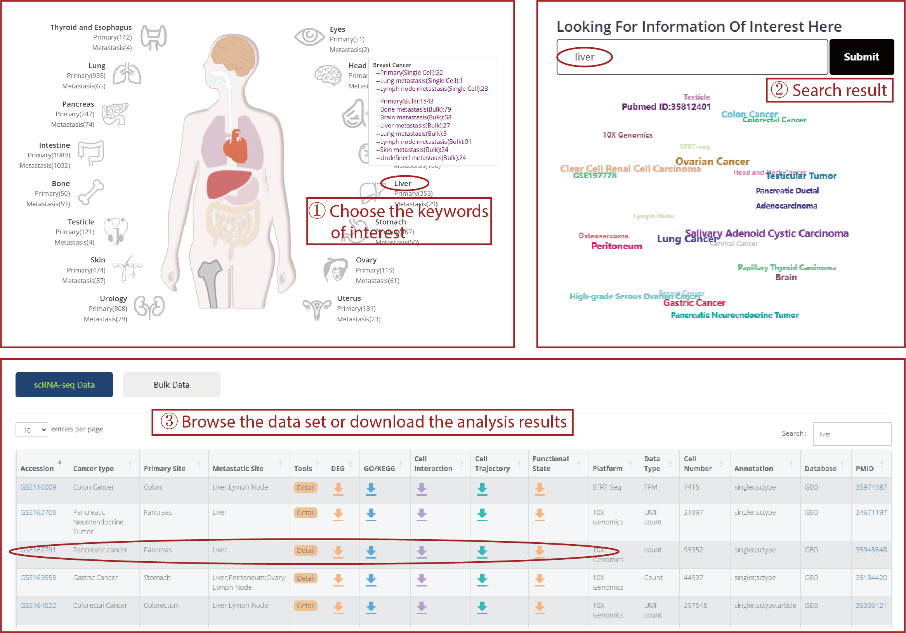
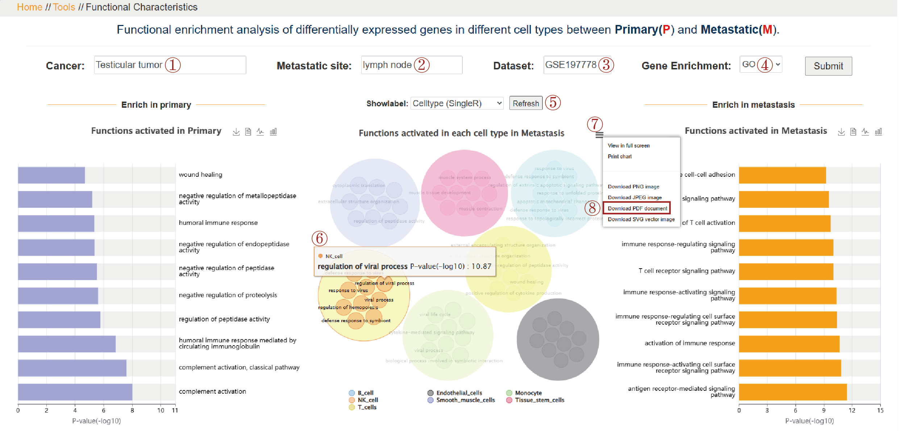

# P2M.db

Integrative Database For ScRNA-Seq And Bulk Transcriptome Data On Cancer Metastasis.

Access: https://www.nidmarker-db.cn/P2M.db or http://43.163.194.16/P2M.db/

---

#### Q1. What can P2M.db do ?

**Search for data:** You can search the P2M.db database for existing scRNA-seq and bulk data that includes **both primary and metastatic samples**. The database comprises 40 scRNA-seq datasets and 81 bulk datasets, spanning 47 types of metastatic cancers, 29 primary tissues, and 18 metastatic tissues.

**Online analysis:** **For scRNA-seq data**, you can browse the number of cells, number of genes, cell types, and other characteristics present in each dataset. All scRNA-seq data can be utilized for online differential gene expression analysis and functional enrichment analysis between the specified metastatic and primary sites. You can also compare the expression of genes with high coefficients of variation in various cell types, both primary and metastatic. Additionally, you can compare different cell interaction pairs, developmental trajectories, and cell functional states between primary and metastatic samples. **For bulk data**, you can perform differential gene expression analysis and functional enrichment analysis between the specified metastatic and primary sites, compare different protein-protein interactions, immune cell infiltration, and conduct survival analysis between primary and metastatic samples.

**Download data:** You can also **download all result files** from online analyses, such as differential gene expression analysis, cell interaction analysis, immune infiltration analysis, and more, to your local computer for visualization and further analysis.

---

#### Q2.How to use P2M.db ?

###### 1. How to find your interested datasets or samples ?

**To begin**, you can navigate to the "statistics" module on the database homepage, where you'll find information about the various types of cancer, primary sites, and metastatic sites included in the database. **Next**, use the quick search feature by entering keywords such as cancer type, primary site, metastatic site, cell type, and sequencing platform in the Search box. Once you initiate the search, you will receive data that matches your criteria, along with detailed information

---

###### 2. How to perform online analysis on a dataset?

P2M.db provides eight online analysis tools based on single-cell data and five online analysis tools based on bulk data, all **aimed at demonstrating the differences between primary and metastatic sites**. Let's take enrichment analysis (scRNA-seq) as an example.

**To begin**, you should select a dataset by specifying the cancer type and metastatic site of interest. Afterward, you can choose between GO or KEGG as your enrichment analysis method. Click the "Submit" button to initiate the functional enrichment analysis.

For each dataset, we offer two options for cell annotation: singleR and scType. We've retained the original annotation results as documented in the data. You can **choose your preferred annotation method** using the "showlabel" tag and refresh the results accordingly.

Within the generated results, you can delve into the differences between primary and metastatic cancers. **Additionally**, you have the option to save the result images in PDF format to your local device.Furthermore, in the "download" section, a variety of result files are available for users to download.

---

#### Q3.How to Contact us ?

###### If you have any question or any suggestion/comment, please feel free to contact us using the following methods:

**Tel**: +86 18645000650

**E-mail**: chaohanxu@hrbmu.edu.cn

**Address**: 194 Xuefu Road, Harbin 150081, CHINA
